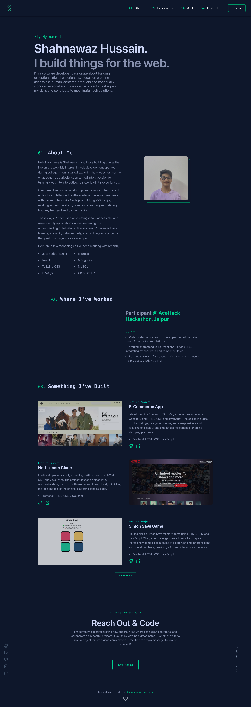

# 🚀 PORTFOLIO 2.0

> **Transforming Visions into Seamless Digital Realities**

---
---

### 🌐 Portfolio 2.0

---

## 🧰 Built With

- **React** – Front-end Library  
- **JavaScript** – Programming Language  
- **Tailwind CSS** – Utility-first CSS framework  
- **Vite** – Lightning-fast build tool  
- **ESLint** – Code linting and formatting  

---

## 📌 Overview

**Portfolio 2.0** is a sleek and modern developer portfolio built using React and Tailwind CSS. It is designed to showcase my skills and projects while providing a top-tier development experience. This boilerplate makes customization and deployment effortless, ensuring a smooth journey from idea to deployment.

---

## 💎 Why Portfolio2.0?

| Feature | Description |
|--------|-------------|
| 🛠️ Modern Stack | Uses Vite, React, and Tailwind CSS for fast and easy development. |
| 🧹 Clean Code | ESLint helps keep your code clean and consistent. |
| 🌐 Smooth Routing | Built-in support for single-page navigation and Vercel deployment. |
| 🎨 Responsive Design | Ready-made components like Navbar, Footer, and Sidebar. |
| 🚀 Live Updates | See changes instantly with Hot Module Replacement (HMR). |
| 🔧 Easy to Customize | Simple, modular code structure for quick edits and updates. |

