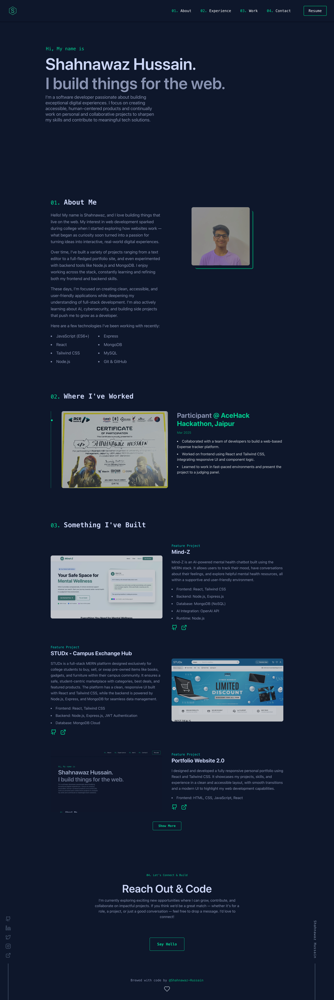

# 🚀 PORTFOLIO 2.0

> **Transforming Visions into Seamless Digital Realities**

---
---

### 🌐 Portfolio 2.0

---

## 🧰 Built With

- **React** 
- **JavaScript** 
- **Tailwind CSS** 
- **Vite** 
- **ESLint** 

---

## 📌 Overview

**Portfolio 2.0** is a sleek and modern developer portfolio built using React and Tailwind CSS. It is designed to showcase my skills and projects while providing a top-tier development experience. This boilerplate makes customization and deployment effortless, ensuring a smooth journey from idea to deployment.

---
